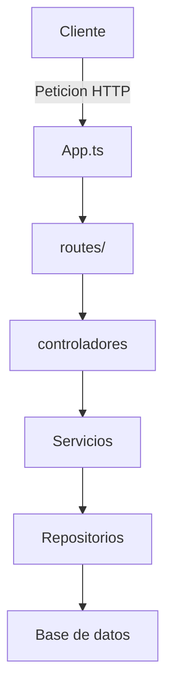

# Full stock

Esta web app sigue un arquitectura en capas. El principio es que cada capa sabe solo una cosa.

```mermaid
graph TD
    A[Cliente] -->|Peticion HTTP| B[App.ts]
    B --> C[routes/]
    C --> D[controladores]
    D --> E[Servicios]
    E --> F[Repositorios]
    F --> G[Base de datos]
```

