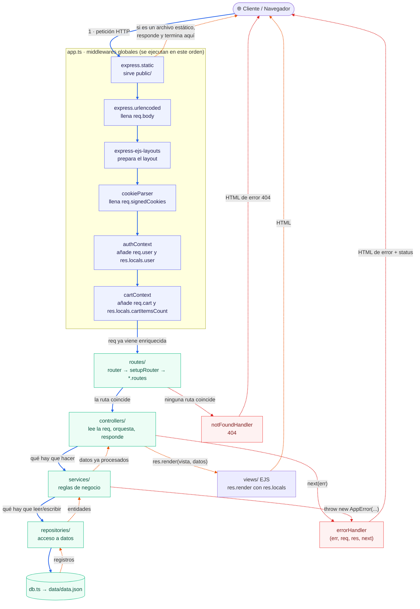

# Full stock

Esta web app sigue un arquitectura en capas. El principio es que cada capa sabe solo una cosa.

## Recorrido de una petición

El diagrama se lee en dos sentidos:

- **Flechas continuas (azules)** → el viaje de **ida**: la _petición_ (`req`) bajando por el pipeline hasta los datos.
- **Flechas punteadas (naranjas)** → el viaje de **vuelta**: la _respuesta_ (`res`) subiendo hasta el navegador.
- **Flechas punteadas (rojas)** → los **desvíos**: rutas no encontradas y errores.

## Notas sobre el pipeline

**El orden de `app.use()` es el orden de ejecución.** Cada middleware recibe `(req, res, next)` y decide si
enriquece la petición y la pasa (`next()`) o si corta el flujo respondiendo él mismo.

| Middleware | Qué añade a la petición | Por qué va en esa posición |
| --- | --- | --- |
| `express.static` | — | Va primero para no gastar trabajo en peticiones de CSS/JS/imágenes. |
| `express.urlencoded` | `req.body` | Los controladores de formularios lo necesitan. |
| `express-ejs-layouts` | — | Debe estar antes de cualquier `res.render`. |
| `cookieParser` | `req.cookies`, `req.signedCookies` | `authContext` y `cartContext` leen cookies firmadas. |
| `authContext` | `req.user`, `res.locals.user` | Necesita las cookies ya parseadas. |
| `cartContext` | `req.cart`, `req.cartId`, `res.locals.cartItemsCount` | Necesita saber si hay usuario: si lo hay busca el carrito por `userId`, si no por la cookie `cartId`. |

**`res.locals` es el puente hacia las vistas.** Lo que un middleware deja en `res.locals` (el usuario logueado,
el contador del carrito) está disponible en todas las plantillas EJS sin que el controlador tenga que pasarlo.
Por eso el header puede pintar el usuario y el carrito en cualquier página.

**Los dos últimos middlewares son las salidas de emergencia**, y por eso se registran después del router:

- `notFoundHandler` solo se ejecuta si ninguna ruta anterior respondió → renderiza un 404.
- `errorHandler` tiene 4 parámetros (`err, req, res, next`), que es como Express reconoce un manejador de
  errores. Recoge cualquier `AppError` (o error inesperado) y lo convierte en una vista de error con su status.
